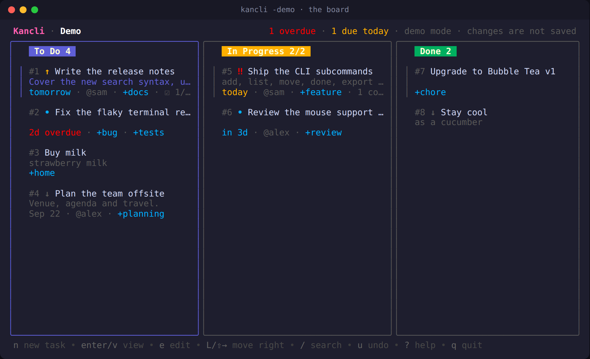
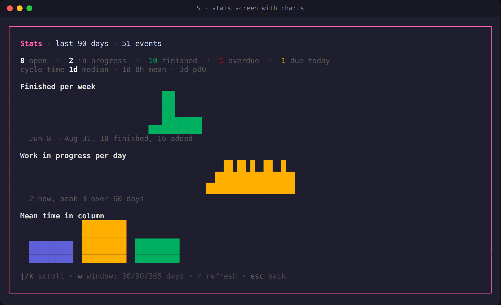
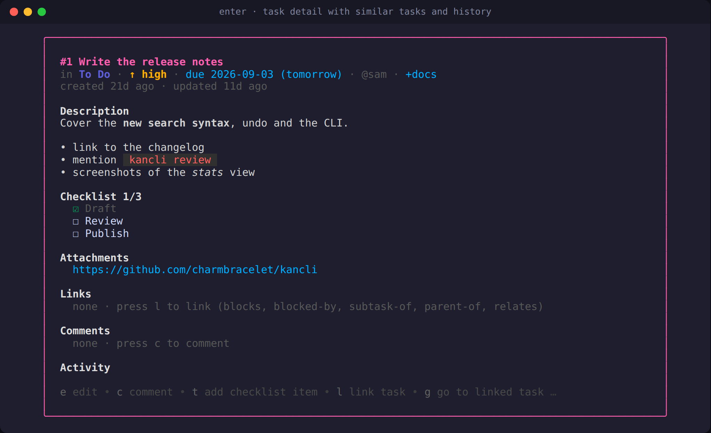
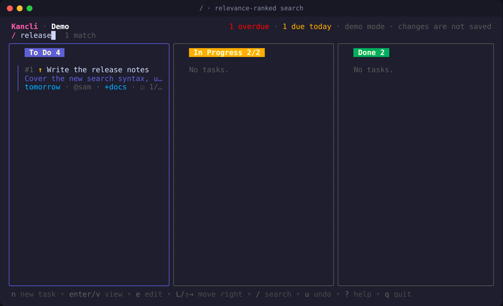
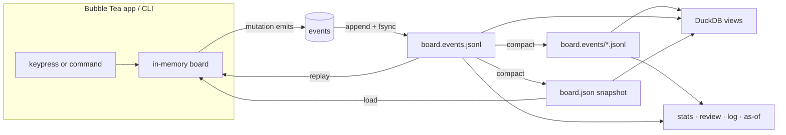
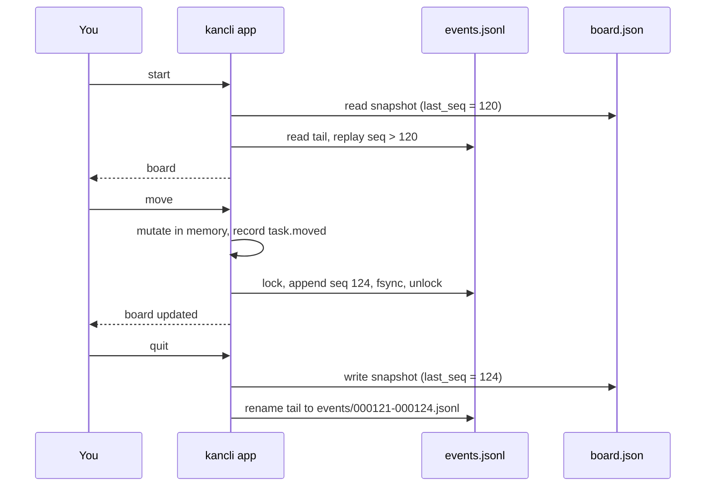
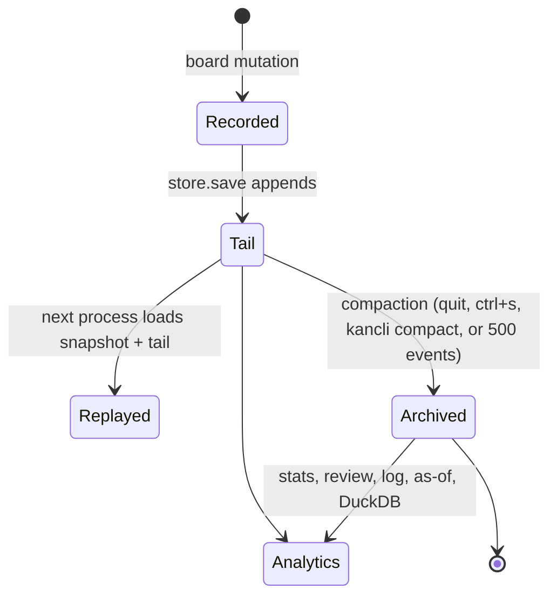
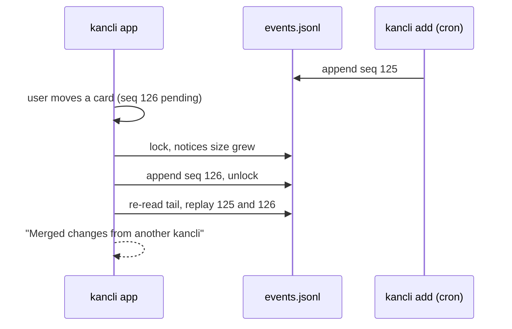
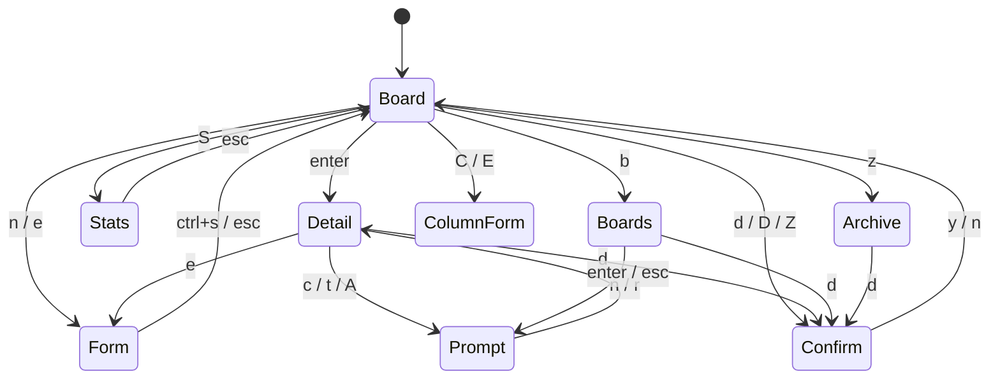

# Kancli

A personal kanban board for the terminal, with an event-sourced store and
built-in analytics.

This is my fork of [charmbracelet/kancli](https://github.com/charmbracelet/kancli),
the demo repo from Charm's kanban tutorial. I took the tutorial skeleton and
built it out into the tool I use day to day: priorities, due dates, labels,
checklists, search, undo, multiple boards, a scriptable CLI, a complete
history of every change, and stats that answer "how long do things take".
It is built with [Bubble Tea](https://github.com/charmbracelet/bubbletea),
[Bubbles](https://github.com/charmbracelet/bubbles),
[Lip Gloss](https://github.com/charmbracelet/lipgloss) and
[ntcharts](https://github.com/NimbleMarkets/ntcharts).

It is a single-user, local tool by design. Everything lives in a few plain
files on your machine; there is no server or account.



| Stats | Task detail | Search |
| --- | --- | --- |
|  |  |  |

## Contents

- [Features](#features)
- [Install](#install)
- [The board](#the-board)
- [Stats and history](#stats-and-history)
- [The CLI](#the-cli)
- [How it works](#how-it-works)
- [Storage and files](#storage-and-files)
- [DuckDB](#duckdb)
- [Configuration](#configuration)
- [Development](#development)

## Features

- **Tasks** with a title, description, priority, due date, labels, assignee,
  checklist, attachments, comments and an activity log. Every task has a
  number you can refer to (`#12`).
- **Columns** you can add, rename, recolour, reorder and delete, with
  optional WIP limits. **Multiple boards** in one store.
- **Search** across every column and field, ranked by relevance, with
  structured filters. **Sort** modes, **multi-select** bulk actions,
  **undo/redo**, an **archive**, and **mouse** support.
- **Similar-task detection** warns when you add something that looks like an
  existing task and lists look-alikes on the task page.
- **Stats**: cycle time, time per column, weekly throughput, work in
  progress over time, aging tasks and per-label figures, as charts in the
  app and as text or JSON on the command line.
- **History**: every change is an event in an append-only log. See the log,
  open the board **as it was on any past date**, and get a Markdown
  **weekly review** generated from it.
- **Safe with other processes**: the app, scripts and cron jobs can all
  write at once; changes are merged, never overwritten.
- **DuckDB bridge** for ad-hoc SQL over tasks and events, and Parquet export.
- **Themes** (default, high-contrast, mono), ASCII borders, compact cards
  and configurable keys.

## Install

Clone it and run the install script. It builds the binary and puts it in
`~/.local/bin`, so `kancli` works from any directory. Your board lives in
your data directory (see [Storage and files](#storage-and-files)), never in
the directory you happen to be in.

```sh
git clone https://github.com/SabienNguyen/kancli.git
cd kancli
./install.sh          # add --path to append ~/.local/bin to your shell startup file
kancli -demo          # sample board with three weeks of history, nothing is saved
kancli                # your own board
```

On Windows, run `.\install.ps1` in PowerShell instead; it installs to
`%LOCALAPPDATA%\kancli\bin` and adds it to your PATH.

The only requirement is Go (`brew install go`, `winget install GoLang.Go`,
or [go.dev/dl](https://go.dev/dl/)). If your Go is older than the version
in `go.mod`, Go downloads the right toolchain by itself. To update later,
`git pull && ./install.sh`.

Other ways in, if you prefer them:

- `make install` does the same as the script; `make build`, `run`, `demo`,
  `test` and `lint` are there too.
- `go install github.com/SabienNguyen/kancli/cmd/kancli@latest` installs
  straight from GitHub into `$(go env GOPATH)/bin` without a clone.

The `duckdb` command-line tool is optional; it enables `kancli stats -q`
and Parquet export. Everything else is pure Go.

## The board

```
kancli                    open your board
kancli -demo              sample data, nothing is saved
kancli -b work            open the board named "work"
kancli -as-of 2026-08-25  the board as it was that day, read-only
kancli -as-of -7d         a week ago
kancli -theme mono        no colours; also: high-contrast
kancli -ascii             +-| borders for terminals without box drawing
kancli -compact           two-line cards
```

### Keys

| Key                | Action                                        |
| ------------------ | --------------------------------------------- |
| `↑`/`k`, `↓`/`j`   | Move the cursor                               |
| `←`/`h`, `→`/`l`   | Focus the previous/next column                |
| `1`…`9`            | Jump to a column                              |
| `n`                | New task in the focused column                |
| `enter` / `v`      | Open the task                                 |
| `e`                | Edit the task                                 |
| `d`                | Delete (asks first)                           |
| `a`                | Archive                                       |
| `space`            | Mark the task for a bulk action               |
| `L`, `⇧→`, `]`     | Move right (all marked tasks if any)          |
| `H`, `⇧←`, `[`     | Move left                                     |
| `J`/`⇧↓`, `K`/`⇧↑` | Move down/up within the column               |
| `/`                | Search (see below); `esc` clears              |
| `s`                | Cycle sort: manual, priority, due, created, updated, title |
| `u` / `U`          | Undo / redo                                   |
| `S`                | Stats screen                                  |
| `b`                | Boards: open, create, rename, delete          |
| `z`                | Archived tasks: restore or delete             |
| `Z`                | Archive every task in the last column         |
| `C` / `E` / `D`    | Add / edit / delete the focused column        |
| `<` / `>`          | Move the focused column                       |
| `R`                | Reload from disk                              |
| `ctrl+s`           | Write a snapshot now                          |
| `?`                | Toggle the full help                          |
| `q` / `ctrl+c`     | Quit                                          |

Mouse: click a column to focus it, click a card to select it, click it again
to open it, and scroll with the wheel.

In the **task form**, `tab` and `shift+tab` move between fields, `enter`
moves to the next field (and saves on the last one), `ctrl+s` saves and `esc`
cancels. The priority field cycles with `←`/`→`. The due date accepts
`2026-09-10`, `today`, `tomorrow`, `fri`, `+3d`, `+2w` or `+1m` and shows
what it parsed to.

In the **task view**, `tab` steps through checklist items and attachments,
`space` toggles an item, `X` removes it, `t` adds a checklist item, `c` adds a
comment, `A` attaches a link or path, `o` opens the attachment, `e` edits,
`H`/`L` move the task, `a` archives, `d` deletes and `esc` goes back. The
page also lists similar tasks and the task's full activity.

In the **stats screen**, `j`/`k` scroll, `w` cycles the window between 30, 90
and 365 days, `r` refreshes and `esc` goes back.

### Search

`/` filters every column at once. Plain words match the title, description,
labels, assignee, checklist and comments, and the results are ordered by
relevance (title hits first) until you pick a sort with `s`. These terms
narrow by field:

```
#12          task number
@sam         assignee
+bug         label (also label:bug)
p:high       priority: none, low, medium, high, urgent
due:today    also tomorrow, overdue, week, none, or a date
col:done     column name or id
```

Terms combine: `+bug due:week @sam` finds Sam's bugs due this week.

### Multiple boards

Press `b` to switch boards, or pass `-board NAME`. Each board has its own
columns and tasks. The last column of a board counts as "done" for the
`done` command, the `Z` shortcut, the due-date badge and all the statistics.

## Stats and history

Press `S` or run `kancli stats`:

```
Board demo · last 90 days · 51 events

Open 8 · in progress 2 · overdue 1 · due today 1
Finished 10 · cycle time median 1d, mean 1d 8h, p90 3d

Throughput (week starting: added / finished)
  Aug 10    3 / 2   ██
  Aug 17    4 / 3   ███
  ...

Time in column (mean / median, samples)
  To Do                 13h / 10h      12
  In Progress            1d / 20h       9
  Done                  14h / 14h       8

Work in progress: 2 now, peak 3 over 60 days

Oldest open tasks
       21d  #1   Write the release notes (To Do)
```

Cycle time is creation to first arrival in the last column. Work in
progress counts tasks in the middle columns. All of it is computed from the
event log, so it is exact rather than inferred from timestamps.

- `kancli log` shows recent events in words; `kancli log -task 12` shows one
  task's history; `-json` prints the raw lines.
- `kancli review` writes a Markdown review of the last week: finished,
  started, added, what needs attention, oldest open tasks, per-label and
  per-week tables. `-days 30` widens it, `-o review.md` saves it.
- `kancli -as-of 2026-08-25` (or `-7d`, or `yesterday`) opens the board as
  it was then, read-only. Works for the UI and for `list`, `show`, `stats`
  and `export`.

## The CLI

Everything can be done without the UI:

```sh
kancli add "Write the release notes" -p high -due fri -l docs -a sam
kancli add -c "in progress" "Ship the CLI"
kancli list                       # table of live tasks
kancli list -q "+bug due:week"    # same search syntax as the UI
kancli list -json                 # for jq and friends
kancli show 12
kancli move 12 done
kancli done 12 13                 # move to the last column
kancli archive 12 && kancli restore 12
kancli rm 12
kancli due                        # overdue and due-today tasks
kancli due -days 7 -notify        # desktop notification when something is due
kancli stats                      # cycle time, throughput, WIP, aging
kancli stats -json
kancli stats -q "SELECT ..."      # any SQL, via DuckDB
kancli review -days 7 -o review.md
kancli log -n 50
kancli export -f md               # or csv, json; -o file
kancli export -o tasks.parquet    # via DuckDB; -events for the log
kancli import tasks.csv           # or .md, .json
kancli boards new Work            # boards use|rename|rm
kancli columns
kancli compact                    # fold the event log into a snapshot
kancli config                     # where the config file lives
kancli keys                       # configurable actions
kancli -version
```

`kancli due -q` prints nothing and exits 1 when something is due, so it works
in a shell prompt or a cron job:

```sh
0 9 * * 1-5  kancli due -notify
0 17 * * 5   kancli review -o ~/reviews/$(date +%F).md
```

### Export and import formats

- **JSON**: the board as stored. `-all` exports every board.
- **CSV**: one row per task with `id, column, title, description, priority,
  due, labels, assignee, created_at, updated_at, archived_at`. Import needs
  only a `title` column.
- **Markdown**: a heading per column and a list item per task, with metadata
  in backticks and indented lines for the description and checklist:

  ```markdown
  ## To Do (2)

  - [ ] #1 Write the release notes `!high due:2026-09-05 +docs @sam`
    Cover the new search syntax.
    - [x] Draft
    - [ ] Review
  ```

- **Parquet** (needs `duckdb`): `-o file.parquet` writes the tasks;
  `-events` writes the event log instead.

Imported tasks get new numbers. Columns are matched by name; unmatched tasks
go to `-c COLUMN` or the first column.

## How it works

The board you see is an in-memory projection. Every change is appended to a
log as an event, and the same log feeds the stats, the review, the history
views and DuckDB. Nothing is ever rewritten in place except the periodic
snapshot.



### Reads stay fast, analytics stay complete

The hot path never touches analytics. Opening the board loads one snapshot
and replays the handful of events since it; moving a card appends one line.
Analytics read the archived segments plus the tail, which is exactly the
same data, so there is nothing to export or keep in sync.

In memory the board is plain slices: tasks in board order, with a small
id-to-position map for lookups. There are no trees or indexes beyond that,
because a personal board is a few thousand contiguous structs at most and a
scan of those is faster than any pointer-chasing structure. Statistics are
incremental: archived segments are parsed once and cached, and the stats
walker keeps its state between calls so only new events are folded in.



### Event lifecycle



### Two processes at once

Appends are serialised with a lock file. A process that finds the log has
grown since it last read it re-reads the snapshot and tail after its own
append, so both sets of changes end up in every process. The app also polls
every two seconds and picks up external events while idle.



### Screens



## Storage and files

Everything is plain files under one directory, no database and no network:

| File                     | What                                                    |
| ------------------------ | ------------------------------------------------------- |
| `board.json`             | Snapshot of the full state as of `last_seq`             |
| `board.events.jsonl`     | Events appended since the snapshot, one JSON per line   |
| `board.events/`          | Archived event segments, immutable, named by sequence   |
| `board.snapshots/`       | Every snapshot ever written, used by `-as-of`           |
| `board.lock`             | Cross-process lock                                      |
| `config.json`            | Optional configuration                                  |

The data directory is `$KANCLI_FILE`'s directory, else
`$XDG_DATA_HOME/kancli/`, else the OS config directory (`~/.config/kancli/`
on Linux, `~/Library/Application Support/kancli/` on macOS). The config file
is `$KANCLI_CONFIG`, else `$XDG_CONFIG_HOME/kancli/config.json`, else the
same OS config directory. Override the data file for one run with `-file`.

Writes are durable and atomic: an event is one line appended and fsynced,
and a snapshot is written to a temp file and renamed into place. A crash can
leave at most a torn last line, which is dropped on load. Boards written by
older versions (the tutorial's format and the previous snapshot-only format)
are migrated on first load, and a history is bootstrapped from their task
timestamps so `-as-of` and stats work from day one.

Backups are a copy of the directory. Keeping it in a synced folder is fine;
two machines editing at the same time will interleave events rather than
corrupt anything, though very close-together edits to the same task may
end up in surprising order.

An event line looks like this:

```json
{"seq":124,"at":"2026-09-02T09:15:00Z","board":"main","kind":"task.moved","task":12,"from":"in_progress","to":"done","actor":"ui"}
```

Kinds: `task.created|updated|moved|reordered|deleted|archived|restored`,
`comment.added`, `checklist.added|toggled|removed`,
`attachment.added|removed`, `column.added|updated|removed|moved`,
`board.added|renamed|removed|activated|restored` (the last is an undo).

## DuckDB

Install the [DuckDB CLI](https://duckdb.org/docs/installation) and kancli
can hand it your data with the views `boards`, `columns`, `tasks`, `events`,
`moves`, `column_stays` and `cycle_times` already defined:

```sh
kancli stats -q "SELECT date_trunc('week', at) AS week, count(*) FROM moves WHERE to_column = 'done' GROUP BY ALL ORDER BY week"
kancli stats -q "SELECT label, median(cycle) FROM cycle_times JOIN tasks USING (board, task), unnest(tasks.labels) AS l(label) GROUP BY ALL" -format markdown
kancli stats -sql > kancli.sql && duckdb -init kancli.sql   # interactive shell with the views
kancli export -o tasks.parquet
kancli export -o events.parquet -events
```

The `tasks` view is built from the current in-memory state, so it is always
up to date; `events` reads the archived segments and the tail directly. Set
`KANCLI_DUCKDB=/path/to/duckdb` if the binary is not on your `PATH`.

## Configuration

All keys are optional:

```json
{
  "file": "~/notes/board.json",
  "board": "work",
  "theme": "default",
  "ascii": false,
  "compact": false,
  "sort": "manual",
  "keys": {
    "quit": ["q", "ctrl+c"],
    "archive": ["x"],
    "archive_done": []
  }
}
```

`theme` is `default`, `high-contrast` or `mono`. `NO_COLOR` in the environment
disables colour too. `keys` maps an action (see `kancli keys`) to a list of
keys; an empty list disables the action.

## Development

```
cmd/kancli/        the executable: flag parsing hands off to internal/cli
internal/board/    the domain: boards, tasks, events and replay, dates,
                   search, sorting, stats and the review report
internal/store/    snapshot + event log on disk, locking, compaction,
                   as-of loading, and the DuckDB bridge
internal/ui/       the Bubble Tea app: board, forms, detail, stats screen,
                   pickers, themes and key maps
internal/cli/      the non-interactive commands and environment setup
internal/config/   the config file
internal/desktop/  opening links and desktop notifications
docs/screenshots/  the images in this README
```

`board` has no dependencies on the other packages; `store` depends on
`board`; `ui` and `cli` depend on both. Tests live next to the code they
cover.

```sh
make test           # go test -race ./...
make lint           # gofmt, go vet, golangci-lint
```

CI runs the same on Linux, macOS and Windows. Pushing a tag like `v1.0.0`
builds release binaries with GoReleaser (see `.goreleaser.yaml`, which also
has a commented Homebrew tap section). Set `KANCLI_DEBUG=1` to write Bubble
Tea debug logs to `./debug.log`.

## Credits

The original tutorial code is by [Charm](https://charm.sh); this fork
keeps their MIT license. If you want the tutorial itself, start from
[charmbracelet/kancli](https://github.com/charmbracelet/kancli).

## License

[MIT](https://github.com/charmbracelet/bubbletea/raw/master/LICENSE)
